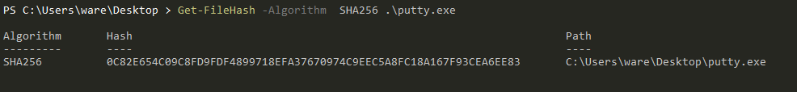
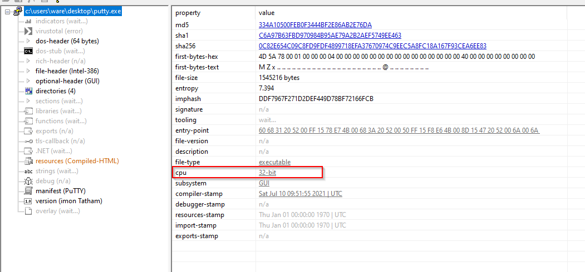
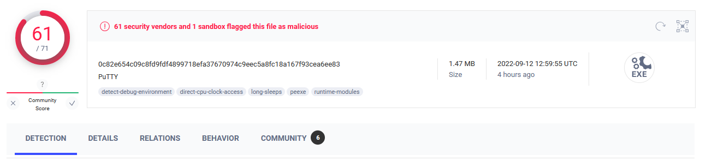
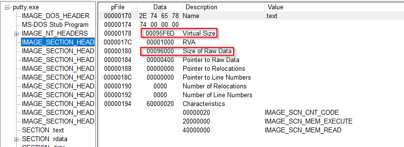
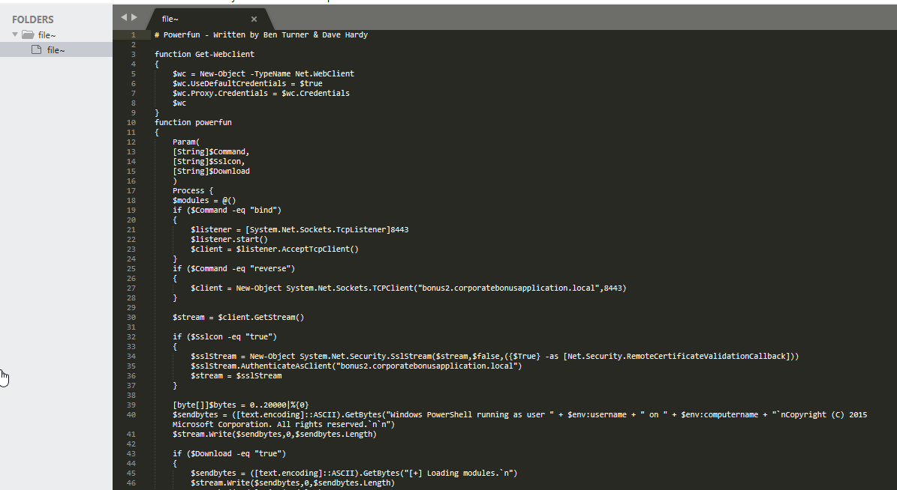
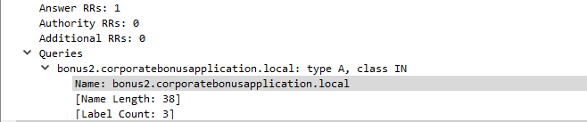
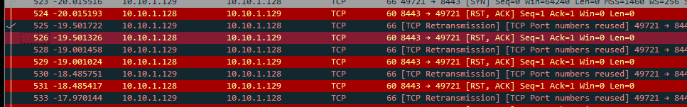
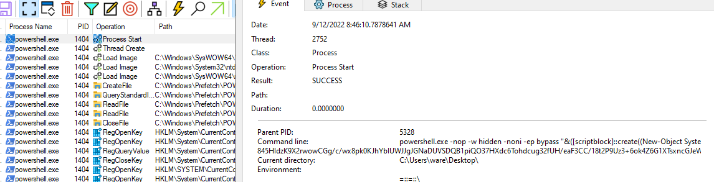
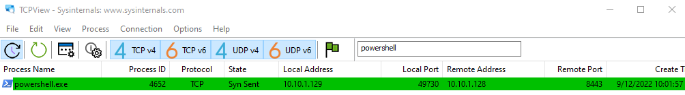
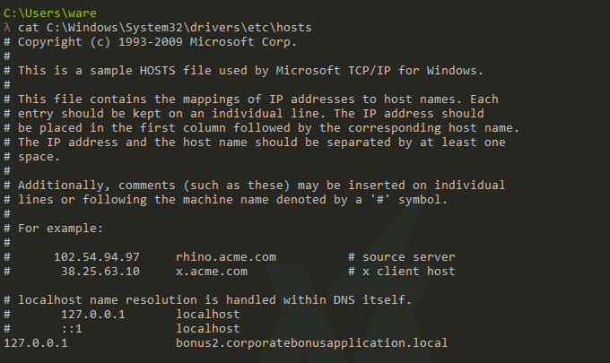

## Challenge Questions:

### Basic Static Analysis
---

- What is the SHA256 hash of the sample?
    A: 0C82E654C09C8FD9FDF4899718EFA37670974C9EEC5A8FC18A167F93CEA6EE83

    Proof: 
    
---
- What architecture is this binary?
    A: 32 bits

    Proof:
    
---
- Are there any results from submitting the SHA256 hash to VirusTotal??

    A: It is marked as malicious
    
    Proof:
    
---
- Describe the results of pulling the strings from this binary. Record and describe any strings that are potentially interesting. Can any interesting information be extracted from the strings?

    A: No, there is not a readeable strings 
---
- Describe the results of inspecting the IAT for this binary. Are there any imports worth noting?

    A : There is a lot of imports can't describe what is the function of the imports
- Is it likely that this binary is packed?

    A: No. The Virtual Size and Stack of Raw Data have similar values

    Proof:

     

---

### Basic Dynamic Analysis
 - Describe initial detonation. Are there any notable occurances at first detonation? Without internet simulation? With internet simulation?
   
    A: In the first denonation it appears a powershell but it closes instantely. 
---
 - From the host-based indicators perspective, what is the main payload that is initiated at detonation? What tool can you use to identify this?
   
    A: In procmon can see a command execution using powershell the payload is encoded with base64 and it can decoded to view the original payload

    Proof: 
    

---
 - What is the DNS record that is queried at detonation?
    
    A: `bonus2.corporatebonusapplication.local`

    Proof:
    
---
 - What is the callback port number at detonation?
    
    A: port 8433

    Proof: 

    
 - What is the callback protocol at detonation?

    A: TCP/SSL
---
 - How can you use host-based telemetry to identify the DNS record, port, and protocol?
    A: In procmon using filters with de PID of the binary 

    Proof: 
    

    
---
 - Attempt to get the binary to initiate a shell on the localhost. Does a shell spawn? What is needed for a shell to spawn?

    A: A shell spawns but can't run any command. To spawn the shell it necessary edit  `C:\Windows\System32\drivers\etc\hosts`
    
    Proof: 

    

   https://user-images.githubusercontent.com/92187317/189789975-04825ee9-6394-49dc-9f0e-06eb7ea05d80.mp4

        
