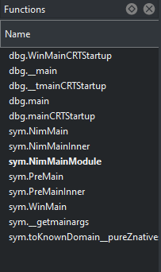
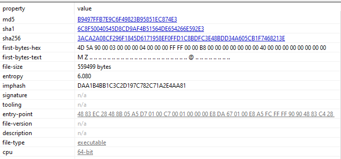
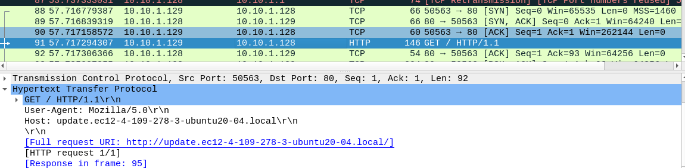
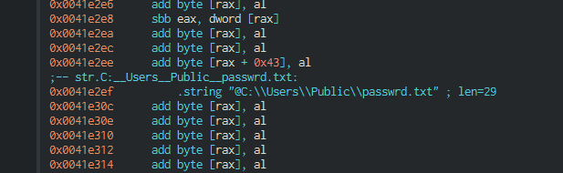
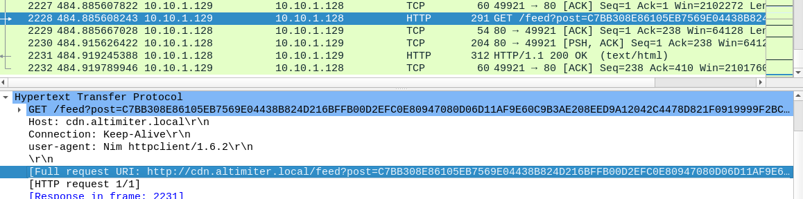
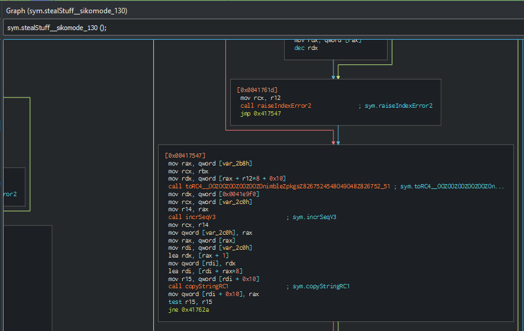
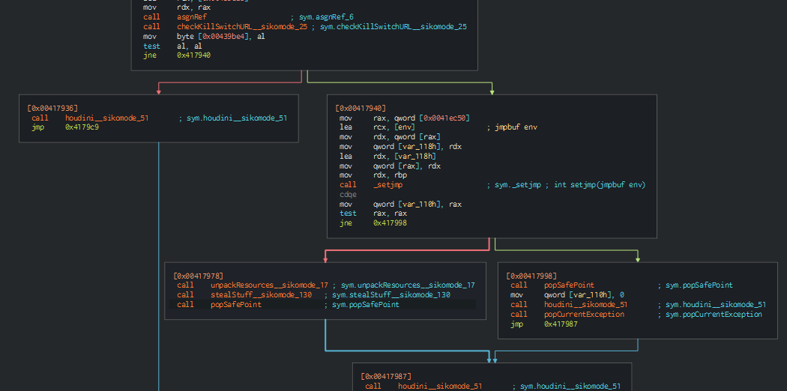
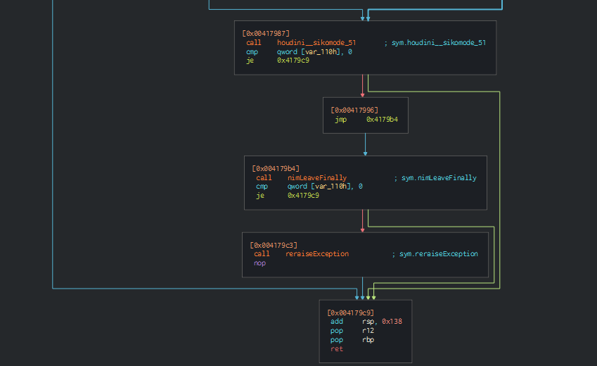

# Challenge Answers

Q: What language is the binary written in?

A: In Cutter can fin Nim modules.

Proof:

---

Q: What is the architecture of this binary?

A: x64 bits.

Proof:

---

Q: Under what conditions can you get the binary to delete itself?

A: `unknown.exe` deletes itself:
- If the binary can't connect to `h[tt]p://update.ec12-4-109-278-3-ubuntu20-04.local`
- If the binary is interrupted interrupted when is sending data to `h[tt]p://cdn.altimiter.local`
- If the binary finishes of sending data 

---

Q: Does the binary persist? If so, how?

A: No. The binary deletes itself.

---

Q: What is the first callback domain?

A: `h[tt]p://update.ec12-4-109-278-3-ubuntu20-04.local`, 

Proof:

---

Q: Under what conditions can you get the binary to exfiltrate data?

A: If the binary connects to the first url. It sends `cosmos.jpeg` encrypted and the password is stored in `C:\Users\Public\passwrd.txt`

Proof:

---

Q: What is the exfiltration domain?

A: `http://cdn.altimiter.local`.

---

Q: What URI is used to exfiltrate data?

A: The URI used is `http://cdn.altimiter.local/feed?post=`

Proof:

---

Q: What type of data is exfiltrated (the file is cosmo.jpeg, but how exactly is the file's data transmitted?)

A: `cosmo.jpeg` is encrypted using as key the content of `passwrd.txt`. 

Proof: 

---

Q: What kind of encryption algorithm is in use?

A: The algorithm is RC4. 

---

Q: What key is used to encrypt the data?

A: `SikoMode`.

---
Q: What is the significance of `houdini`?

A: `houdini` is a method to delete the binary.

Proof:

