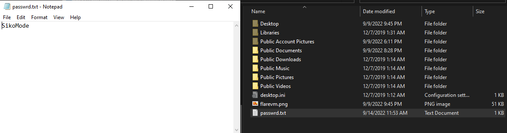

## Challenge Questions:

- What language is the binary written in?

    A: In Cutter can fin Nim modules.

    Proof:

    

---

- What is the architecture of this binary?

    A: x64 bits.

    Proof:

    

---

- Under what conditions can you get the binary to delete itself?

    A: `unknown.exe` deletes itself:
    - If the binary can't connect to `h[tt]p://update.  ec12-4-109-278-3-ubuntu20-04.local`
    - If the binary is interrupted interrupted when is sending data to `h[tt]p://cdn.altimiter.local`
    - If the binary finishes of sending data 

---

- Does the binary persist? If so, how?

    A: No. The binary deletes itself.

---

- What is the first callback domain?

    A: `h[tt]p://update.ec12-4-109-278-3-ubuntu20-04.local`, 

    Proof:

    

---

- Under what conditions can you get the binary to exfiltrate data?

    A: If the binary connects to the first url. It sends `cosmos.jpeg` encrypted and the password is stored in `C:\Users\Public\passwrd.txt`

    Proof:

    

---

- What is the exfiltration domain?

    A: `http://cdn.altimiter.local`.

---

- What URI is used to exfiltrate data?

    A: The URI used is `http://cdn.altimiter.local/feed?post=`

    Proof:

    

---

- What type of data is exfiltrated (the file is cosmo.jpeg, but how exactly is the file's data transmitted?)

    A: `cosmo.jpeg` is encrypted using as key the content of `passwrd.txt`. 

    Proof: 

    

---

- What kind of encryption algorithm is in use?

    A: The algorithm is RC4. 

    Proof:
    
    

---

- What key is used to encrypt the data?

    A: `SikoMode`.

---
- What is the significance of `houdini`?

    A: `houdini` is a method to delete the binary.

    Proof:

    

    